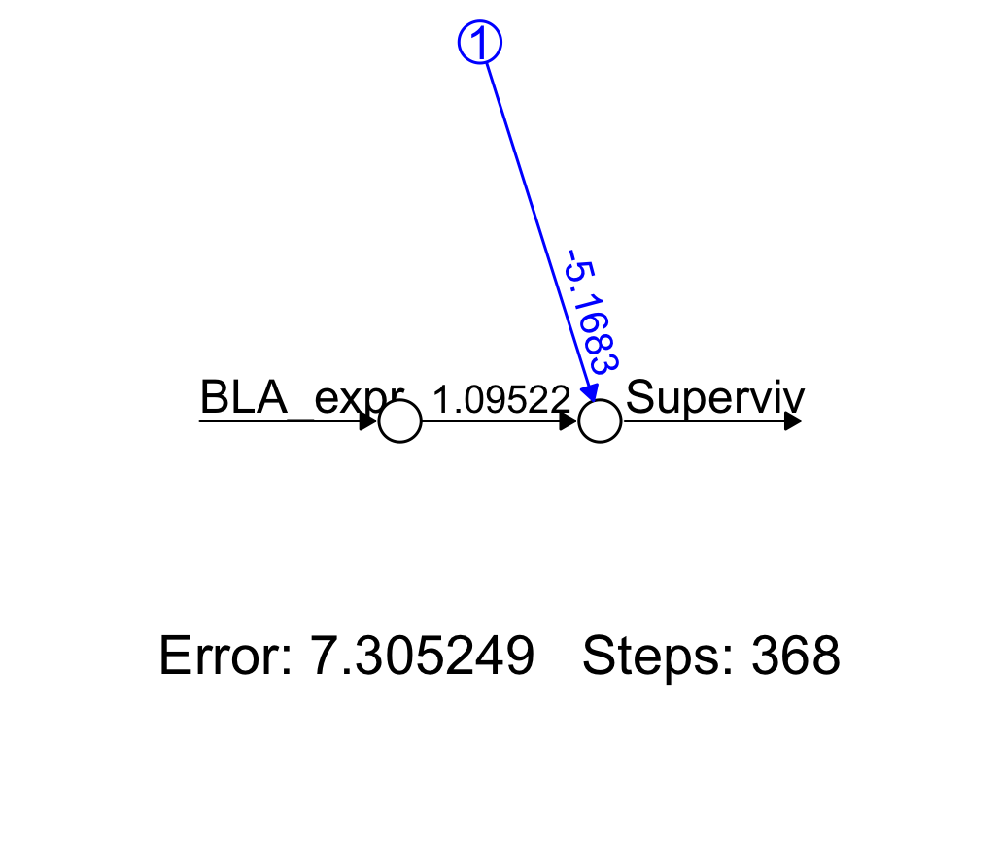
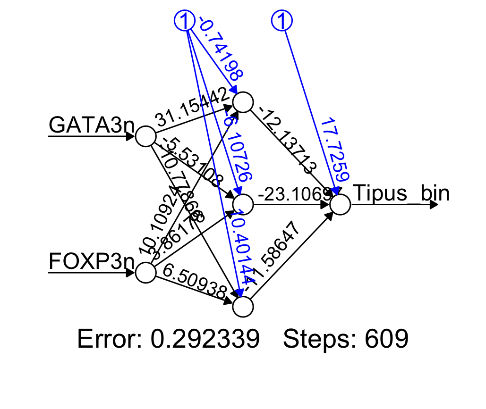

En el capítol anterior hem vist com la regressió logística permet fer classificació binària a partir de diversos predictors. Aquest enfocament funciona molt bé quan:\
- la relació entre els predictors i el logit de la probabilitat és aproximadament lineal,\
- el nombre de predictors no és excessivament gran.

Tanmateix, en molts problemes biomèdics moderns ens trobem sovint amb situacions com ara:\
- molts predictors (desenes o centenars de biomarcadors, intensitats de senyal, característiques extretes d’imatges…),\
- moltes observacions, gràcies a tècniques d’adquisició d’altes prestacions,\
- sospita que la relació entre les variables i la resposta pot ser clarament no lineal.

Aleshores és natural plantejar-se la pregunta:\
Podem utilitzar una alternativa a la regressió logística que sigui capaç de capturar relacions més complexes entre els predictors i la resposta, mantenint al mateix temps la interpretació de “probabilitat de classe”?

Una possible resposta són les **xarxes neuronals artificials**. Aquest tipus de models formen part del camp del *machine learning*, un conjunt de tècniques que permeten que un ordinador pugui **aprendre patrons a partir de les dades** sense que calgui programar explícitament totes les regles del procés.

En el nostre cas utilitzarem **aprenentatge supervisat** (*supervised learning*), on disposem de dades d’entrada i de les seves respostes corresponents, i l’objectiu és entrenar un model que sigui capaç de predir aquestes respostes per a noves observacions.

## La neurona artificial

### Funcionament bàsic

Abans d’explorar arquitectures més complexes, començarem per la seva unitat fonamental: la **neurona artificial**. El nom prové d'una analogia molt simplificada amb les neurones biològiques:\
- reben senyals d'entrada (inputs) amb “força” diferent, que poden ser excitadors (positius) o inhibidors (negatius),\
- combinen aquestes senyals en un potencial d'activació,\
- i “disparen” quan aquest potencial supera un llindar.

En una neurona artificial, les entrades són un vector de predictors:
$$ \boldsymbol{x} = ( x_1, x_2, \dots, x_p ) $$
La neurona calcula primer una combinació lineal:
$$ z = w_0  + w_1x_1 + w_2 x_2 + \dots + w_p x_p $$
on $w_0$ és el biaix (*bias*) i $w_i$ són els pesos (*weights*). Aquesta combinació pondera cada entrada segons la “força” que té en l’activació de la neurona. Pesos i biaix es poden combinar en un vector:
$$ \boldsymbol{w} = ( w_0, w_1, \dots, w_p ) $$


Aquest valor passa per una **funció d'activació** que introdueix **no linealitat**.  
Per a classificació binària, la més habitual és la sigmoide:
$$ \sigma(z) = \frac{1}{1+e^{-z}} $$

El resultat:
$$ \hat{y} = \sigma(z)$$ 
és un valor entre 0 i 1 interpretable com a **probabilitat**. 
La funció sigmoide actua com un mecanisme d’activació suau: quan el valor $z$ és prou alt, la sortida s’apropa a 1; quan és prou baix, s’apropa a 0. Aquest comportament és, de manera molt simplificada, anàleg a la resposta d’una neurona biològica, que s’“activa” quan el seu potencial d’acció supera un llindar.

**Nota:** La funció sigmoide és, matemàticament, la mateixa funció logística que hem utilitzat en regressió logística. En l’àmbit de les xarxes neuronals és habitual anomenar-la *sigmoid*, mentre que en estadística tradicional es fa servir el terme *logistic*. La funció, però, és exactament la mateixa.

---

### La neurona en R

Per implementar una neurona en R, necessitem dues operacions bàsiques: la combinació lineal dels predictors i l’aplicació de la funció d’activació.

La combinació lineal es pot calcular amb un producte escalar:
```{r, eval=FALSE}
z <- sum(x * w) 
```
on `x` i `w` són vectors.
El primer element de `x` ha de ser igual a 1, ja que és el que multiplica el biaix $w_0$.

La funció sigmoide es defineix com:
```{r}
sigmoid <- function(z){
  1 / (1 + exp(-z))
}
```

Amb això, podem implementar tota la neurona en una sola funció:
```{r}
neurona <- function(w, x){
  z <- sum(x * w)      # producte escalar
  y_pred <- sigmoid(z)  # activació sigmoidal
  return(y_pred)
}
```
Aquesta funció retorna la predicció de la neurona per a un conjunt de pesos i biaix `w` i un vector de predictors `x`.

---

### Entrenament, prediccions i errors

Carreguem les mateixes dades que vam utilitzar per construir el model de regressió logística simple:
```{r}
df <- read.csv("datasets/regressio/Ecoli.csv")
str(df)
```
A partir d’aquestes dades, volem ajustar un model que ens permeti fer prediccions. En el llenguatge de *machine learning*, direm que volem **entrenar** la neurona.

Això correspon a trobar els pesos que millor resolguin la tasca de classificació amb les nostres dades. A aquest conjunt de dades li direm **conjunt d’entrenament** (*training dataset*).

Per continuar, és útil convertir el dataframe en una matriu i separar els predictors de la resposta:
```{r}
X <- model.matrix(superviv ~ BLA_expr, data=df)
X <- as.matrix(X)

Y <- df$superviv
```

Podem observar que `model.matrix()` afegeix automàticament la columna `(Intercept)` amb tots 1, que s’utilitza per representar el biaix de la neurona:
```{r}
head(X)
```

Per poder aplicar la neurona, necessitem un vector de pesos, que encara no hem ajustat. El definirem inicialment de manera aleatòria. Com que només tenim un predictor, necessitem dos pesos: un per al biaix i un per al predictor, és a dir, un element per a cada columna de `X`:
```{r}
set.seed(123)

w <- rnorm(ncol(X))
w
```

Ara podem calcular el resultat de la neurona i comparar-lo amb els valors observats de supervivència per les primeres 5 files:
```{r}
for (i in 1:5) {
  y_pred <- neurona(w, X[i, ] )
  cat(
    sprintf("Mostra %2d | Predicció: %.3f | Real: %d | Error: %.3f\n",
            i, y_pred, Y[i], y_pred - Y[i])
  )
}
```

Com era d’esperar, amb pesos inicials aleatoris la neurona produeix prediccions que no tenen gaire a veure amb els valors reals de supervivència. Això també es reflecteix en els valors de l’**error**:
$$ \operatorname{error} = \hat{y} - y $$
que indica com s’allunya la predicció del valor observat. Si la predicció coincideix exactament amb l’observació, l’error és igual a 0. 

---

### Actualització dels pesos

Per ajustar el model, hem de modificar els pesos de manera que l’error sigui mínim (idealment, zero) sobre totes les dades. Però, com podem actualitzar els pesos de forma sistemàtica?

Si hi pensem, l’error ens indica en quina direcció els hem de modificar:\
- Si l’error és positiu ($\hat{y}>y$), la neurona està “massa activada”:
$\rightarrow$ cal reduir els pesos.

- Si l’error és negatiu ($\hat{y}<y$), la neurona està “massa poc activada”:
$\rightarrow$ cal augmentar els pesos.

Aquesta idea es pot formalitzar amb la següent regla d’actualització:
$$ w \leftarrow  w - \eta \,\operatorname{error} \, x $$

on $\eta$ és el *learning rate*, que controla com de ràpid modifiquem els pesos en funció de l’error. La seva elecció és crucial per garantir la convergència de l’entrenament.

**Nota**: L’actualització dels pesos que hem descrit correspon exactament al *gradient descent* aplicat a una neurona sigmoïdal amb funció de pèrdua *cross-entropy*. En aquest capítol no derivarem aquesta expressió, ja que el nostre objectiu és entendre el funcionament bàsic de la neurona i la seva implementació.

---

### Algorisme d'entrenament (*Training loop*)

Finalment, podem utilitzar la següent rutina per ajustar el model:\
1.  Comencem amb pesos aleatoris.\
2.  Seleccionem aleatòriament una de les mostres del conjunt d’entrenament.
\
3.  Calculem la predicció de la neurona amb els pesos actuals.\
4.  Actualitzem els pesos de manera proporcional a l’error.\
5.  Repetim el procés a partir del punt 2.

Hem de repetir aquests passos un nombre suficient de vegades per assegurar la convergència. En aquest exemple començarem amb `n_iter = 100`. També fixem el learning rate a 0.1:
```{r}
eta <- 0.1       # learning rate
n_iter <- 100
```

Com veurem en més detall més endavant, és important normalitzar els valors dels predictors per millorar l’estabilitat numèrica, però no hem de normalitzar la columna `(Intercept)`:
```{r}
X[,-1] <- scale(X[,-1])
```

Implementem ara la rutina d’entrenament en R, imprimint l’error cada 5 iteracions:
```{r}
for (iter in 1:n_iter) {
  idx <- sample(nrow(X),1)
  # Extract sample j
    x <- X[idx, ]      
    y <- Y[idx] 

    # Predicció de la neurona
    y_pred <- neurona(w, x)

    # Error = (y_pred - y)
    error <- y_pred - y
    
    # Weight update
    w <- w - eta * error * x
    
    if(iter%%5==0){
    cat(
    sprintf("Iteració %d | Error: %.3f\n",
            iter, error)
    )
    }
}
```

Observem que l’error pot oscil·lar considerablement entre iteracions, ja que estem utilitzant actualitzacions amb una sola mostra (*Stochastic Gradient Descent*). Tot i això, després de 100 iteracions el model ha ajustat els pesos:
```{r}
w
```

### Prediccions i avaluació del model

Un cop entrenada la neurona (és a dir, després d’haver ajustat els pesos) ja podem comprovar les prediccions sobre totes les dades del conjunt d’entrenament.

Per a cada fila de la matriu de predictors `X`, calculem la sortida de la neurona:
```{r}
y_pred <- numeric(nrow(X))

for (i in 1:nrow(X)) {
  y_pred[i] <- neurona(w, X[i, ])
}
```

La neurona produeix probabilitats (`y_pred`). Per convertir-les en una decisió de classe, utilitzem un llindar de 0.5, tal com es fa habitualment en regressió logística:
```{r}
y_class <- ifelse(y_pred >= 0.5, 1, 0)
```

Una primera manera de mesurar el rendiment del model és mitjançant la matriu de confusió, que ens indica quantes prediccions són correctes i quantes s'han equivocat:
```{r}
cm <- table(Predicció = y_class, Real = df$superviv)
cm
```

La matriu de confusió depèn del llindar, doncs fem servir la corba ROC per avaluar el model per a tots els llindars possibles.
Això ens dona una mesura més robusta de la seva capacitat de classificació.

Calculem l'objecte ROC:
```{r}
library(pROC)

# Calcular objecte ROC
roc_obj <- roc(response = df$superviv, predictor = y_pred, quiet = TRUE)
```

Representem la corba calculant també l'AUC, que ens dona una indicació de qualitat del model:
```{r}
plot(roc_obj,
     legacy.axes = TRUE,
     col = "firebrick",
     lwd = 3,
     asp = .5,
     main = "Corba ROC per la neurona")

legend(
  "bottomright",
  legend = sprintf("AUC = %.3f", auc(roc_obj)),
  col = "firebrick",
  lwd = 3
)
```

Encara que la neurona només s’hagi entrenat durant 100 iteracions i amb un procediment molt senzill, veiem que el model bàsic és capaç d’assolir un rendiment comparable al d’una regressió logística.

Això no és casualitat: una neurona sigmoïdal i un model de regressió logística tenen estructures matemàtiques molt semblants. La diferència principal no rau tant en el que calculen, sinó en com ajusten els pesos.

A més, la manera com s’entrena una neurona ens proporciona la flexibilitat necessària per **afegir i combinar moltes neurones** en capes successives, la qual cosa permet representar relacions molt més riques, flexibles i clarament no lineals.

---

## Xarxes neuronals

Les xarxes neuronals artificials sorgeixen d’una idea molt simple: combinar moltes neurones artificials per resoldre problemes que una sola neurona no pot resoldre. Una neurona individual és essencialment un model molt similar a la regressió logística, i per tant només pot separar dades de manera lineal. Per representar relacions més complexes necessitem més neurones i, sobretot, organitzar-les de manera adequada.

A un conjunt de neurones que reben les mateixes entrades i treballen en paral·lel li diem **capa** (*layer*).
Si combinem diverses neurones dins d’una capa podem captar diferents aspectes de les dades al mateix temps; si combinem diverses capes en seqüència, cada capa pot transformar l’espai de dades i passar aquesta representació transformada a la següent. D’aquesta manera, la xarxa construeix transformacions cada vegada més abstractes i pot capturar relacions fortament no lineals.

En una xarxa neuronal, la capa d’entrada conté les variables del model i la capa de sortida produeix la predicció final (per exemple, una probabilitat). Entre elles hi pot haver **capes ocultes** (*hidden layers*), que són les que introdueixen la no linealitat real del model. No representen variables observables, sinó transformacions internes generades pel procés d’aprenentatge.

Amb prou neurones i capes ocultes, una xarxa neuronal pot aproximar pràcticament qualsevol funció; això és el que estableix el **teorema d’aproximació universal**. L’elecció del nombre de neurones i de capes no té regles fixes i depèn d’un compromís entre capacitat i risc d’*overfitting*.

Quan una xarxa incorpora diverses capes ocultes parlem d'**aprenentatge profund** (*deep learning*). Tot i que el terme s’utilitza sovint per referir-se a models molt grans, podem considerar deep qualsevol arquitectura amb més d’una capa oculta.

---

### Xarxes neuronals amb llibreries d'R

Fins ara hem implementat una neurona artificial de manera manual per entendre els seus principis fonamentals. Aquest exercici és molt útil per entendre què fa internament una xarxa neuronal, però no és pràctic quan volem combinar moltes neurones o afegir capes.

Per això utilitzarem una llibreria que ens permet definir i entrenar xarxes neuronals de manera molt més flexible sense haver de programar nosaltres mateixos tot el procés d’optimització. Una alternativa senzilla i adequada per a xarxes petites és el paquet `neuralnet`.

```{r}
# install.packages('neuralnet')
library(neuralnet)
```

Aquesta llibreria permet:\
- combinar neurones en capes,\
- definir arquitectures amb una o més capes ocultes,\
- utilitzar funcions d’activació no lineals,\
- i visualitzar de forma clara l’estructura de la xarxa.

Els arguments més importants de la funció `neuralnet()` són:\
- `hidden`: vector que indica el nombre de neurones en cada capa oculta
(per exemple, `hidden = c(3,2)` crea una xarxa amb dues capes ocultes: 3 neurones → 2 neurones);\
- `act.fct`: la funció d’activació de les neurones internes i (si toca) de la neurona de sortida;
- `linear.output`: si és `FALSE`, la neurona de sortida també aplica la funció d’activació (ideal per classificació binària amb activació sigmoidal).

## Una primera xarxa: una sola neurona

Normalitzem les dades en el dataframe:
```{r}
df$BLA_expr_n <- scale(df$BLA_expr)
```

Comencem implementant una xarxa que és essencialment equivalent a la neurona que hem programat manualment. Això s’aconsegueix posant `hidden = 0`, és a dir, sense cap capa oculta:
```{r}
# Xarxa amb 1 sola neurona
nn_simple <- neuralnet(
superviv ~ BLA_expr_n,
data = df,
hidden = 0,            # cap neurona oculta
act.fct = "logistic",  # activació sigmoïdal
linear.output = FALSE  # volem probabilitats
)
```

Amb aquesta configuració, la xarxa és simplement: input → neurona sigmoidal → sortida, el mateix comportament que el model entrenat “a mà”. Això ho podem veure a la representació gràfica:
```{r}
plot(nn_simple)
```
```{r, echo=FALSE}
# L'incloem al document
library(knitr)

```
Cal remarcar que aquesta neurona implementada amb `neuralnet` presenta algunes diferències respecte a la versió manual:\
- minimitza l’error mitjà quadràtic (MSE) en lloc de la cross-entropy,\
- actualitza els pesos un cop per iteració utilitzant totes les dades disponibles (*batch gradient descent*).

Tot i això, el comportament final és molt semblant.

Avaluem la capacitat predictiva del model utilitzant l’AUC:
```{r}
pred_simple <- compute(nn_simple, df[, "BLA_expr_n", drop = FALSE])$net.result

roc_obj <- roc(response = df$superviv, predictor = pred_simple[,1], quiet = TRUE)

auc(roc_obj)
```

Veurem que el rendiment és molt similar al d’una regressió logística i al de la neurona manual. Això és esperable, ja que totes tres aproximacions comparteixen la mateixa estructura bàsica: una combinació lineal seguida d’una funció sigmoidal.

### Un cas més complex

Considerem ara un escenari amb dades d’anàlisi cel·lular. Suposem que estem estudiant dues poblacions de cèl·lules immunitàries, que anomenarem:\
- Tipus A: cèl·lules en estat “activat”,\
- Tipus B: cèl·lules en estat “regulador”.

Mitjançant citometria de flux o seqüenciació single-cell s'ha mesurat l’expressió de dos factors de transcripció importants en el sistema immune:\
- GATA3, associat a fenotips activadors,\
- FOXP3, característic de cèl·lules reguladores.

En aquest experiment, coneixem prèviament (per validació experimental o per estudis anteriors) quines cèl·lules pertanyen al Tipus A i quines al Tipus B. L'objectiu és utilitzar aquestes dades per aprendre **un model capaç de predir el tipus cel·lular** a partir de noves observacions d’expressió de GATA3 i FOXP3.

```{r, echo=FALSE, eval=TRUE}
set.seed(123)
n = 300
noise = 0.25
theta <- runif(n, 0, pi)

# tipus cel·lular A

X_A <- cbind(
5 + 2*cos(theta),
5 + 2*sin(theta)
) + matrix(rnorm(2*n, sd=noise), ncol=2)

# tipus cel·lular B

X_B <- cbind(
7.5 - 2*cos(theta),
6 - 2*sin(theta)
) + matrix(rnorm(2*n, sd=noise), ncol=2)

X <- rbind(X_A, X_B)
y <- c(rep("Tipus A", n), rep("Tipus B", n))

df_bio <- data.frame(
GATA3 = round(X[,1], 2),
FOXP3 = round(X[,2], 2),
tipus = factor(y)
)

write.csv(df_bio, "datasets/regressio/tipus_cell.csv", row.names = FALSE)
```

Carreguem les dades:
```{r}
df_cell <- read.csv("datasets/regressio/tipus_cell.csv")
str(df_cell)
```
Respecte als exemples anteriors, ara tenim dos predictors (GATA3 i FOXP3) i una resposta nominal (tipus).
Transformem la resposta perquè sigui numèrica, afegint una nova columna al dataframe:
```{r}
df_cell$tipus_bin <- ifelse(df_cell$tipus=="Tipus A", 0, 1)
```
Aquesta conversió és necessària perquè les xarxes neuronals només poden operar amb valors numèrics: els pesos i les actualitzacions del gradient requereixen quantitats contínues. Les classes categòriques, per tant, s’han de representar amb codificacions numèriques (com 0/1 o variables *dummy*).

Representem les dades gràficament. Podem fer un diagrama de dispersió on l’eix $x$ i l’eix $y$ corresponen als dos predictors, i codificar la resposta amb colors:
```{r}
# Colors (Okabe–Ito colourblind-safe)
col_A <- "#1b9e77"   # Verd
col_B <- "#d95f02"   # Taronja

# Símbols reals per classe
pch_A_real <- 19   # Cercle ple
pch_B_real <- 15   # Quadrat ple

# Assignem colors i símbols reals
cols_real <- ifelse(df_cell$tipus_bin == 0, col_A, col_B)
pch_real  <- ifelse(df_cell$tipus_bin == 0, pch_A_real, pch_B_real)

# Plot base
plot(
  df_cell$GATA3, df_cell$FOXP3,
  col = cols_real,
  pch = pch_real,
  cex = 1.3,
  xlab = "GATA3",
  ylab = "FOXP3",
  main = "Expressió de GATA3 i FOXP3 en dues poblacions cel·lulars"
)

# Llegenda
legend(
  "bottomleft",
  legend = c("Tipus A (real)", "Tipus B (real)"),
  col = c(col_A, col_B),
  pch = c(pch_A_real, pch_B_real),
  pt.cex = c(1.3, 1.3),
  pt.lwd = c(1, 1),
  bty = "n"
)
```


La disposició dels punts segueix una geometria en forma de “mitges llunes”: els dos estats cel·lulars tenen perfils relacionats, però **no linealment separables**. No podem dibuixar cap recta que separi tots els punts vermells i blaus de manera perfecta.

Aquesta estructura és típicament problemàtica per a models lineals com la regressió logística o per a una sola neurona. Cap d’aquests models pot representar fronteres de decisió corbades.
Per poder separar correctament les dues poblacions, necessitem **xarxes neuronals amb capes ocultes**, que introdueixen no linealitats i permeten aprendre fronteres de decisió molt més flexibles.
 
---
 
### Overfitting i importància de separar train i test

Fins ara hem avaluat el model utilitzant el mateix conjunt de dades amb què l’hem entrenat. Aquest procediment és útil per entendre el funcionament de l’algorisme, però no ens diu res sobre la capacitat del model de generalitzar a dades noves.

Si un model és massa flexible o s’entrena durant massa temps, pot caure en overfitting, és a dir, pot aprendre patrons espuris o soroll específic de les dades d’entrenament.
En aquests casos, el model té un rendiment excel·lent sobre les dades d’entrenament, però funciona malament quan rep dades noves.

Per això, en *machine learning* és essencial separar les dades en:\
- **Training set**: per ajustar els pesos del model.\
- **Test set**: per avaluar la performance real, és a dir, la capacitat de generalització.

A vegades també es fa servir un tercer conjunt:\
- **Validation set**: per avaluar la performance durant l'entrenament i ajustar hiperparàmetres (com el learning rate, nombre d’iteracions, etc.).

Doncs, separem el dataset de cèl·lules en train (70%) i test (30%):
```{r}
n <- nrow(df_cell)
idx_train <- sample(1:n, size = 0.7 * n)

train <- df_cell[idx_train, ]
test  <- df_cell[-idx_train, ]
```

---

### Normalització de les dades

En molts algorismes d’aprenentatge automàtic, incloses les xarxes neuronals, és recomanable **normalitzar els predictors** abans d’entrenar el model. La normalització transforma cada variable perquè tingui una escala comparable (generalment mitjana 0 i desviació estàndard 1).

Això és útil perquè:\
- evita que una variable amb valors molt grans tingui més influència numèrica que una altra,\
- fa que el procés d’entrenament sigui més estable,\
- sovint aconsegueix que el model aprengui més ràpid i de manera més fiable.

És important recordar que la normalització s’ha de basar **només en les dades del conjunt d’entrenament**. Els mateixos valors de mitjana i desviació s’han d’aplicar després al conjunt de test i validació, per evitar introduir informació futura dins del procés d’entrenament.

Per aplicar correctament la normalització en el nostre exemple, podem procedir així:
```{r}
# Mitjanes i desviacions standard
mitjanes <- colMeans(train[, c("GATA3", "FOXP3")])
desv_st <- sapply(train[, c("GATA3", "FOXP3")], sd)

# Normalització del training set
train[, c("GATA3n", "FOXP3n")] <-
  scale(train[, c("GATA3", "FOXP3")], center = mitjanes, scale = desv_st)

# Normalització del test set (IMPORTANT: mateixos paràmetres!)
test[, c("GATA3n", "FOXP3n")] <-
  scale(test[, c("GATA3", "FOXP3")], center = mitjanes, scale = desv_st)
```

### Xarxa sense capes ocultes (una sola neurona)

Després de preparar les dades, podem entrenar una primera xarxa neuronal molt simple. Aquesta arquitectura, amb **cap neurona oculta**, és equivalent a una regressió logística: només tenim una combinació lineal dels predictors seguida d’una activació sigmoidal.

Això ens servirà per veure fins a quin punt un model estrictament lineal és capaç de separar les dues poblacions cel·lulars en aquest problema clarament no lineal.

Per entrenar aquesta xarxa amb el paquet `neuralnet`, fem:
```{r}
nn0 <- neuralnet(
  tipus_bin ~ GATA3n + FOXP3n,
  data = train,
  hidden = 0,
  act.fct = "logistic",
  linear.output = FALSE
  )
```

Un cop entrenat el model, podem calcular les prediccions tant sobre el conjunt de training com sobre el de test. Això ens permet veure si el model generalitza bé o si és incapaç de capturar la geometria inherent de les dades.
```{r}
# Prediccions sobre train
pred_train <- compute(nn0, train[, c("GATA3n","FOXP3n")])$net.result
train_class <- ifelse(pred_train >= 0.5, 1, 0)

# Prediccions sobre test
pred_test <- compute(nn0, test[, c("GATA3n","FOXP3n")])$net.result
test_class <- ifelse(pred_test >= 0.5, 1, 0)
```

Amb les prediccions, avaluem el model mitjançant la matriu de confusió, que mostra si confon els tipus cel·lulars; i l’AUC, que mesura la capacitat discriminativa independentment del llindar.

Aquests indicadors ens donen una primera impressió de si una sola neurona és suficient per resoldre el problema.
```{r}
# Matrius de confusió
cat("Matriu de confusió — TRAIN\n")
print(table(Predicció = train_class, Real = train$tipus_bin))

cat("\nMatriu de confusió — TEST\n")
print(table(Predicció = test_class, Real = test$tipus_bin))

# AUC
auc_train <- auc(train$tipus_bin, pred_train[,1], quiet = TRUE)
auc_test  <- auc(test$tipus_bin, pred_test[,1], quiet = TRUE)

cat(sprintf("\nAUC train: %.3f\nAUC test:  %.3f\n", auc_train, auc_test))
```
Els resultats mostren que la neurona aconsegueix una separació parcial. El model és capaç de capturar tendències generals però, tal com era d’esperar, no pot modelar bé una frontera de decisió fortament corbada com la d’aquest dataset en forma de "mitges llunes".

Això es veu de manera molt clara quan representem gràficament les prediccions sobre el conjunt de *test*: hi podem superposar, sobre els punts reals, símbols que indiquen la classificació que dona la xarxa.

A la figura següent:\
- els punts semitransparents indiquen el tipus cel·lular real,\
- els símbols superposats indiquen la classe predita,\
- si una predicció és incorrecta, veurem símbol i punt amb colors diferents.

Això permet inspeccionar visualment en quines zones de l’espai la neurona falla més clarament, típicament en aquelles on la separació requereix corbes o formes no lineals.
```{r}
# Símbols per a les prediccions
pch_A_pred <- 3    # X
pch_B_pred <- 4    # +
  
# Assignem colors i símbols reals
cols_real <- ifelse(test$tipus_bin == 0, col_A, col_B)
pch_real  <- ifelse(test$tipus_bin == 0, pch_A_real, pch_B_real)

# Colors predits
cols_pred <- ifelse(test_class == 0, col_A, col_B)
pch_pred  <- ifelse(test_class == 0, pch_A_pred, pch_B_pred)

# Plot base: dades reals amb transparència
plot(
  test$GATA3, test$FOXP3,
  col = adjustcolor(cols_real, alpha.f = 0.65),
  pch = pch_real,
  cex = 1.3,
  xlab = "GATA3",
  ylab = "FOXP3",
  main = "Prediccions de la xarxa (neurona)"
)

# Superposem les prediccions amb símbols segons classe
points(
  test$GATA3, test$FOXP3,
  col = cols_pred,
  pch = pch_pred,
  lwd = 1.5,
  cex = 1
)

# Llegenda
legend(
  "bottomleft",
  legend = c("Tipus A (real)", "Tipus B (real)", 
             "Predicció A", "Predicció B"),
  col = c(col_A, col_B, col_A, col_B),
  pch = c(pch_A_real, pch_B_real, pch_A_pred, pch_B_pred),
  pt.cex = c(1.3, 1.3, 1, 1),
  pt.lwd = c(1, 1, 1.5, 1.5),
  bty = "n"
)
```


### Xarxa neuronal amb una capa oculta

Després de veure les limitacions d’una xarxa sense capes ocultes, podem provar una arquitectura lleugerament més rica: una xarxa neuronal amb **una sola capa oculta**.

Aquesta és la primera configuració que permet capturar **relacions no lineals** entre els predictors, ja que la combinació de neurones ocultes amb funcions d’activació sigmoïdals pot generar fronteres de decisió corbades.

En el nostre cas utilitzarem una capa oculta amb **3 neurones**, una dimensió suficient per modelar la geometria en forma de mitges llunes del nostre dataset.
```{r}
nn1 <- neuralnet(
tipus_bin ~ GATA3n + FOXP3n,
data = train,
hidden = 3,
act.fct = "logistic",
linear.output = FALSE
)
```

Un cop entrenada, podem visualitzar l’estructura interna de la xarxa.
El gràfic generat per neuralnet mostra clarament:\
- la capa d’entrada (GATA3n i FOXP3n),\
- les tres neurones de la capa oculta, amb els seus pesos,\
- la neurona de sortida sigmoïdal.

Aquesta visualització ajuda a entendre que, tot i ser relativament petita, la xarxa ja té diversos pesos i biaixos que es poden ajustar, i per tant una capacitat representacional força superior a la d’una sola neurona.
```{r}
plot(nn1)
```

```{r, echo=FALSE}

```

Ara podem calcular les prediccions tant sobre les dades d’entrenament com sobre les de test. Igual que abans, transformem les probabilitats en classes i comparem amb les etiquetes reals:
```{r}
# Prediccions sobre train
pred_train <- compute(nn1, train[, c("GATA3n","FOXP3n")])$net.result
train_class <- ifelse(pred_train >= 0.5, 1, 0)

# Prediccions sobre test
pred_test <- compute(nn1, test[, c("GATA3n","FOXP3n")])$net.result
test_class <- ifelse(pred_test >= 0.5, 1, 0)
```

Finalment, avaluem el rendiment del model. La matriu de confusió i les AUC ens indiquen fins a quin punt la xarxa ha après una frontera de decisió adequada.
```{r}
# Matrius de confusió
cat("Matriu de confusió — TRAIN\n")
print(table(Predicció = train_class, Real = train$tipus_bin))

cat("\nMatriu de confusió — TEST\n")
print(table(Predicció = test_class, Real = test$tipus_bin))

# AUC
auc_train <- auc(train$tipus_bin, pred_train[,1], quiet = TRUE)
auc_test  <- auc(test$tipus_bin, pred_test[,1], quiet = TRUE)

cat(sprintf("\nAUC train: %.3f\nAUC test:  %.3f\n", auc_train, auc_test))
```

Els resultats mostren que:\
- la xarxa amb una capa oculta captura molt millor la separació no lineal,\
- el rendiment sobre training és notablement alt,\
- el rendiment sobre test també millora substancialment, encara que es detecta un lleuger *overfitting*, esperable en xarxes petites sense regularització.

Per entendre visualment com funciona aquesta xarxa més flexible, representem les dades reals i superposem les prediccions:
```{r}
# Símbols per a les prediccions
pch_A_pred <- 3    # X
pch_B_pred <- 4    # +
  
# Assignem colors i símbols reals
cols_real <- ifelse(test$tipus_bin == 0, col_A, col_B)
pch_real  <- ifelse(test$tipus_bin == 0, pch_A_real, pch_B_real)

# Colors predits
cols_pred <- ifelse(test_class == 0, col_A, col_B)
pch_pred  <- ifelse(test_class == 0, pch_A_pred, pch_B_pred)

# Plot base: dades reals amb transparència
plot(
  test$GATA3, test$FOXP3,
  col = adjustcolor(cols_real, alpha.f = 0.65),
  pch = pch_real,
  cex = 1.3,
  xlab = "GATA3",
  ylab = "FOXP3",
  main = "Prediccions de la xarxa (una capa oculta)"
)

# Superposem les prediccions amb símbols segons classe
points(
  test$GATA3, test$FOXP3,
  col = cols_pred,
  pch = pch_pred,
  lwd = 1.5,
  cex = 1
)

# Llegenda
legend(
  "bottomleft",
  legend = c("Tipus A (real)", "Tipus B (real)", 
             "Predicció A", "Predicció B"),
  col = c(col_A, col_B, col_A, col_B),
  pch = c(pch_A_real, pch_B_real, pch_A_pred, pch_B_pred),
  pt.cex = c(1.3, 1.3, 1, 1),
  pt.lwd = c(1, 1, 1.5, 1.5),
  bty = "n"
)
```

Aquest comportament il·lustra perfectament el poder de les capes ocultes: la xarxa pot deformar l’espai internament per aconseguir una separació gairebé perfecta.